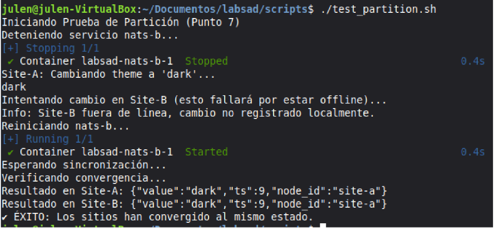

# SAD &mdash; Laboratorio: Sincronización de almacenes KV de NATS mediante CRDT

- Alberto Olcina Calabuig
- Julen García Muñoz
- Pedro Simão Januário Vieira

## Compilación y ejecución

**En el directorio raíz**, ejecutar ```./init.sh```. Esto arrancará 3 contenedores Docker (el servidor NATS de _site-a_, el de _site-b_ y el del _hub_ de replicación; según ```docker-compose.yaml```), comprobará la conexión a ellos y creará un _bucket_ ```config``` en cada uno de los servidores de los nodos y el _stream_ ```KV_REPLICATION``` para replicación en el _hub_, del que los dos primeros actuarán como _leaf nodes_.

**En la carpeta ```nats-kv-syncd```**, ejecutar ```go build```, que compilará el agente, creando el programa ```nats-kv-syncd```.

Para ejecutar ambos agentes (el de _site-a_ y el de _site-b_):

```sh
./nats-kv-syncd --nats-url nats://localhost:4222 --node-id site-a
./nats-kv-syncd --nats-url nats://localhost:5222 --node-id site-b
```

## Lógica CRDT

Lorem ipsum dolor sit amet.

## Almacenamiento de metadados

Lorem ipsum dolor sit amet.

## Pruebas

La carpeta ```test``` contiene todos los _scripts_, que facilitan las pruebas, mencionados en esta sección.

### Partición

Esta prueba simula un fallo crítico de red donde un nodo queda aislado mientras el otro sigue enviando actualizaciones. Queremos demostrar que el agente garantiza la consistencia.

**El _script_ auxiliar se encuentra en ```test/test_partition.sh```.**

#### Escenario

Al ejecutar ```docker compose stop nats-b```, el nodo Site-B queda totalmente desconectado del sistema. En este estado, el agente de Site-A no puede enviar actualizaciones a B y el agente de Site-B no puede recibir operaciones remotas ni publicar cambios.

#### Escritura durante el aislamiento

Mientras un nodo esta caido, el _script_ realiza una operación PUT en el Site-A con el valor dark.

#### Recuperación y sincronización

Al ejecutar ```docker compose start nats-b```, el nodo B vuelve a estar en línea y el agente de Site-B recibe la operación que se perdió durante la desconexión.

Además, el agente de B compara el JSON recibido con su estado local y compara el _timestamp_:
TS remoto > TS local.

Como el remoto es mayor que el local, site-B actualiza el _bucket_ local para coincidir con site-A.

#### Verificación

El _script_ finaliza consultando ambos _buckets_. El resultado obtenido: ```{"value":"dark","ts":5,"node_id":"site-a"}```. Esto confirma que ambos nodos llegaron al mismo estado.



Lorem ipsum dolor sit amet.


---
Alberto Olcina, Julen García y Pedro Januário

diciembre 2025
