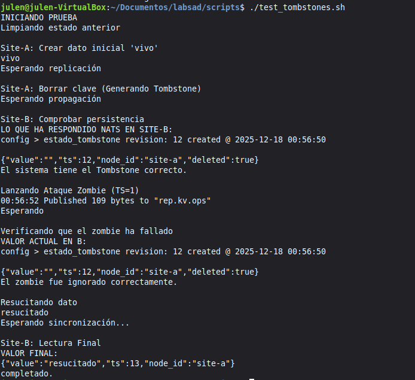

# SAD &mdash; Laboratorio: Sincronización de almacenes KV de NATS mediante CRDT

- Alberto Olcina Calabuig
- Julen García Muñoz
- Pedro Simão Januário Vieira

## Compilación y ejecución

**En el directorio raíz**, ejecutar ```./init.sh```. Esto arrancará 3 contenedores Docker (el servidor NATS de _site-a_, el de _site-b_ y el del _hub_ de replicación; según ```docker-compose.yaml```), comprobará la conexión a ellos y creará un _bucket_ ```config``` en cada uno de los servidores de los nodos y el _stream_ ```KV_REPLICATION``` para replicación en el _hub_, del que los dos primeros actuarán como _leaf nodes_.

**En la carpeta ```nats-kv-syncd```**, ejecutar ```go build```, que compilará el agente, creando el programa ```nats-kv-syncd```.

Para ejecutar ambos agentes (el de _site-a_ y el de _site-b_):

```sh
./nats-kv-syncd --nats-url nats://localhost:4222 --node-id site-a
./nats-kv-syncd --nats-url nats://localhost:5222 --node-id site-b
```

## Lógica CRDT

El sistema implementa una replicación basada en CRDTs de estado (_State-based CRDT_), específicamente utilizando la estrategia _LWW-Register_ (_Last-Writer-Wins_) para garantizar la convergencia eventual de los datos entre los nodos.

Los pilares de la implementación son:

- Reloj Lógico de Lamport: En lugar de depender de relojes físicos (propensos a _clock skew_), cada nodo mantiene un contador entero (```localCounter```). Este contador se incrementa con cada operación local y se actualiza al recibir operaciones remotas (```max(local, remoto) + 1```), asegurando una relación causal entre eventos.

- Regla de Resolución de Conflictos: Al recibir una operación de replicación, el agente decide si aplicar el cambio o descartarlo comparando los metadatos de la operación entrante con los almacenados localmente. La actualización gana ("Last Writer Wins") si:

    - Su _timestamp_ lógico (```Ts```) es mayor que el local.

    - En caso de empate en el Ts, su identificador de nodo (```NodeID```) es mayor lexicográficamente (por ejemplo, _site-b_ gana a _site-a_).

    - _Tombstones_ (Lápidas): Los borrados no eliminan físicamente el registro del KV inmediatamente. En su lugar, se realiza una operación de actualización (```PUT```) marcando una bandera ```deleted: true```. Esto permite que la "intención de borrado" viaje por la red con su propio _timestamp_ y persista para ganar sobre mensajes antiguos (_zombies_) que pudieran llegar desordenados.

## Almacenamiento de metadados

Para que la lógica CRDT funcione sobre NATS KV, no almacenamos los valores en crudo (ej. "dark"), sino que encapsulamos cada dato en una estructura JSON rica que incluye los metadatos necesarios para la resolución de conflictos.

Existen dos niveles de almacenamiento persistente en cada nodo:

1. _Bucket_ Principal (```config```): Cada clave almacena un objeto JSON serializado (```StoredCRDT```) con la siguiente estructura, la cual permite que cada clave tenga su propio "tiempo lógico" independiente asociado. Si la bandera ```deleted``` es ```true```, la aplicación interpreta que la clave no existe, aunque físicamente ocupe espacio en el KV:

```json
{
  "value": "contenido_real",
  "ts": 12345,
  "node_id": "site-a",
  "deleted": false
}
```
2. _Bucket_ de Metadatos (```config_meta```): Se utiliza un _bucket_ auxiliar para persistir el estado global del agente. Específicamente, se guarda la clave ```logical_clock```, que almacena el último valor del contador de Lamport. Esto permite que, si el agente se reinicia, pueda recuperar su "tiempo" y no empezar desde cero, evitando que sus nuevas operaciones sean descartadas erróneamente como antiguas por otros nodos.

## Pruebas

La carpeta ```test``` contiene todos los _scripts_, que facilitan las pruebas, mencionados en esta sección.

### 1. Partición

Esta prueba simula un fallo crítico de red donde un nodo queda aislado mientras el otro sigue enviando actualizaciones. Queremos demostrar que el agente garantiza la consistencia.

**El _script_ auxiliar se encuentra en ```test/test_partition.sh```.**

#### Escenario

Al ejecutar ```docker compose stop nats-b```, el nodo Site-B queda totalmente desconectado del sistema. En este estado, el agente de Site-A no puede enviar actualizaciones a B y el agente de Site-B no puede recibir operaciones remotas ni publicar cambios.

#### Escritura durante el aislamiento

Mientras un nodo esta caido, el _script_ realiza una operación PUT en el Site-A con el valor dark.

#### Recuperación y sincronización

Al ejecutar ```docker compose start nats-b```, el nodo B vuelve a estar en línea y el agente de Site-B recibe la operación que se perdió durante la desconexión.

Además, el agente de B compara el JSON recibido con su estado local y compara el _timestamp_:
TS remoto > TS local.

Como el remoto es mayor que el local, site-B actualiza el _bucket_ local para coincidir con site-A.

#### Verificación

El _script_ finaliza consultando ambos _buckets_. El resultado obtenido: ```{"value":"dark","ts":5,"node_id":"site-a"}```. Esto confirma que ambos nodos llegaron al mismo estado.


### 2. _Tombstone_

Esta prueba verifica el ciclo de vida completo de un borrado lógico (_Tombstone_) y la robustez del protocolo CRDT frente a la llegada de mensajes desordenados.

**El _script_ auxiliar se encuentra en ```test/test_tombstones.sh```.**

#### Generación del Tombstone

Al ejecutar la orden de borrado (```nats kv del```) en Site-A, el agente intercepta la operación. En lugar de permitir que el dato desaparezca, el agente inserta inmediatamente un registro JSON con la marca ```deleted: true``` y un ```timestamp``` actualizado. Esto asegura que el "borrado" viaje a Site-B como un dato persistente.

#### Simulación de Ataque Zombie

Con el dato ya borrado (_tombstone_ presente en ambos sitios), el _script_ inyecta artificialmente un mensaje antiguo en el bus de replicación con un _timestamp_ obsoleto (TS=1). Esto simula un paquete de red retrasado que intenta reescribir un dato que ya ha sido eliminado.

#### Resolución de Conflictos y Protección

El agente de Site-B recibe el mensaje zombie y compara los metadatos: TS remoto < TS local.

Como el _timestamp_ del ataque es menor que el de la lápida actual, el agente aplica la regla LWW e ignora la operación.

#### Resurrección y Verificación

Finalmente, se realiza una escritura legítima ("resucitado") con un _timestamp_ actual.

El _script_ verifica que esta nueva operación sí es aceptada, ya que su TS > TS tombstone.

El resultado obtenido en Site-B es el JSON: ```{"value":"resucitado", "ts":..., "deleted": false}.```

Esto confirma que el sistema permite recuperar claves borradas sin perder la consistencia frente a datos antiguos.



---
Alberto Olcina, Julen García y Pedro Januário

diciembre 2025
